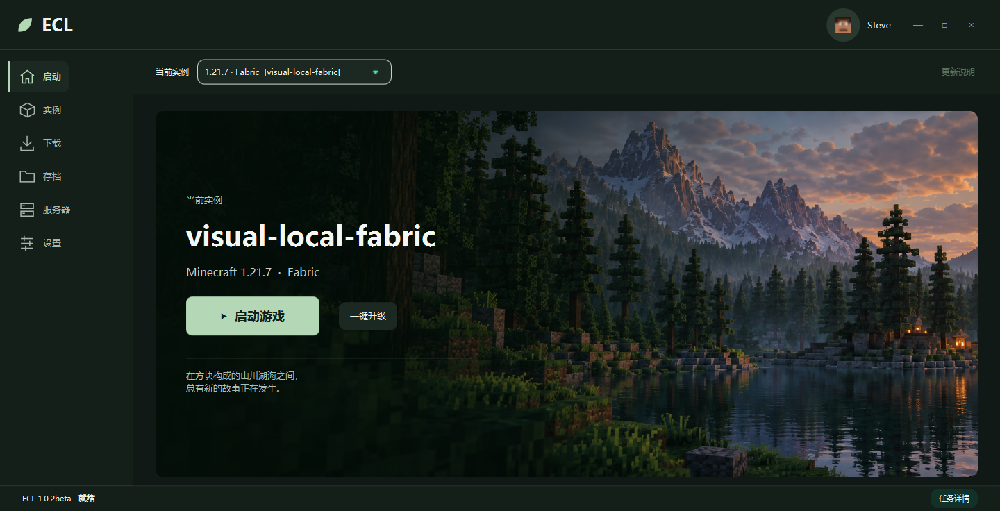
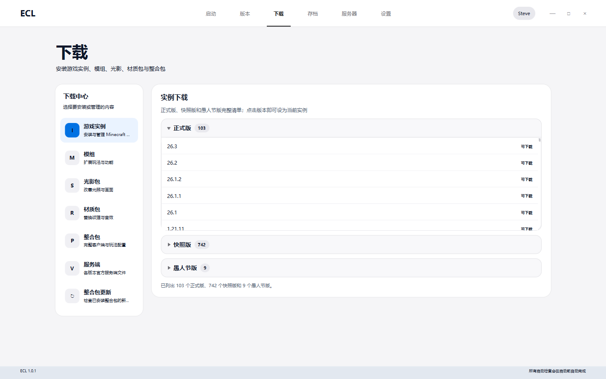
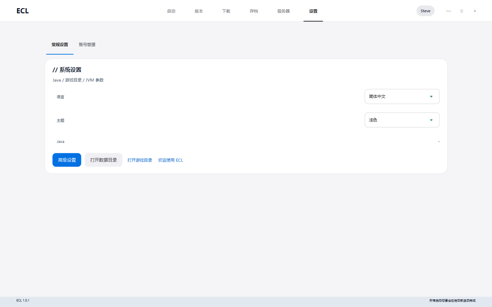

# ECL

[](https://github.com/linrenhao0813-cmd/ECL/actions/workflows/ci.yml)

ECL 是一个基于 Java 21 和 JavaFX 的 Minecraft Java 版启动器，提供游戏安装、账户管理、模组与整合包管理、存档备份和游戏启动功能。

当前版本为 **1.0.1**。本文以 Windows 环境为例介绍使用、构建与开发流程。

## 界面预览

以下为当前源码在 Windows 上实际运行的界面截图，使用独立的初始配置和默认离线账户，尚未安装游戏实例。下载页展示运行时获取的版本列表，内容会随上游更新。

### 启动首页



### 游戏下载



### 常规设置



## 主要功能

| 功能 | 说明 |
| --- | --- |
| 游戏与实例 | 安装、重装和删除游戏版本，识别已有实例，记录游玩时长与启动次数 |
| 模组加载器 | 支持 Fabric、Quilt、Forge 和 NeoForge，为模组实例提供隔离运行目录 |
| 账户与皮肤 | 支持 Microsoft、离线和 Yggdrasil 外置登录；支持正版账户上传皮肤、离线账户导入本地皮肤 |
| 内容下载 | 从 Modrinth、CurseForge 搜索模组、资源包、光影包和整合包，按实例版本与加载器筛选 |
| 模组管理 | 解析依赖，批量更新、启用、禁用和卸载模组，拖入本地 `.jar` 文件导入 |
| 整合包 | 导入 Modrinth、CurseForge 整合包，导出 ECL、MultiMC、CurseForge 和 MRPACK 格式 |
| 运行环境 | 自动选择 Java，按需下载 Eclipse Temurin JRE，按实例保存内存和 JVM 参数 |
| 存档与诊断 | 管理世界存档、备份与恢复，提供中文崩溃诊断 |
| 服务器 | 浏览公开服务器目录、查询状态、复制地址和设置直连目标 |
| 界面 | 支持浅色与深色主题，以及简体中文、繁体中文和英文 |

在线整合包更新目前仅支持已记录 Modrinth 来源的实例。CurseForge 整合包支持导入和导出，暂不支持在线版本更新。

## 从源码运行

准备 **JDK 21** 和 Git，确认 `JAVA_HOME` 指向 JDK 21，且 `java` 可在终端中执行。仓库自带 Gradle Wrapper，无需单独安装 Gradle。

在 PowerShell 中执行：

```powershell
git clone https://github.com/linrenhao0813-cmd/ECL.git
cd ECL
.\gradlew.bat run
```

首次构建会下载 Gradle 8.14.4 和项目依赖。账户在线登录、下载游戏和检索在线内容也需要网络连接。

## 开始使用

1. **添加账户**：在首页或账户设置中选择 Microsoft 登录、离线账户或 Yggdrasil 外置登录。
2. **选择游戏目录**：在设置中指定 `.minecraft` 目录；已有实例可通过“版本”菜单选择。
3. **安装游戏**：打开“下载”中的“游戏实例”，选择 Minecraft 版本及需要的加载器。
4. **安装内容**：选中目标实例后，搜索并安装模组、资源包、光影包或整合包。
5. **调整并启动**：按需设置 Java、内存、JVM 参数和分辨率，回到首页启动游戏。

下载和启动进度显示在操作页面及首页的“当前活动”卡片中。选中实例后编辑高级启动设置，Java 路径、内存和 JVM 参数会保存到该实例。

### 在线服务配置

**CurseForge** 需要 API Key，可在高级设置中填写，也可通过环境变量 `CURSEFORGE_API_KEY` 或 JVM 系统属性 `ecl.curseforge.apiKey` 提供。未配置时仍可使用 Modrinth。

**Microsoft 登录** 默认使用内置公共客户端 ID。如需覆盖，可设置环境变量 `ECL_MICROSOFT_CLIENT_ID` 或 JVM 系统属性 `ecl.microsoft.clientId`。

### 皮肤

Microsoft 正版账户的皮肤上传至官方服务；离线账户的皮肤保存在本机，并在启动时注入。支持 64×64 或 64×32 的 PNG 图片，大小不超过 1 MiB，可选择经典或纤细模型。

离线皮肤与玩家名绑定，区分大小写；修改玩家名后需要重新导入。

## 构建与检查

在仓库根目录使用 JDK 21 执行：

| 命令 | 用途 |
| --- | --- |
| `.\gradlew.bat run` | 启动图形界面 |
| `.\gradlew.bat check` | 运行 JUnit 5、Checkstyle、SpotBugs 和 JaCoCo 校验 |
| `.\gradlew.bat build` | 构建并验证全部模块 |
| `.\gradlew.bat installDist` | 生成分发目录 `ecl-boot/build/install/ECL/` |
| `.\gradlew.bat captureLauncherUi` | 生成界面快照 `ecl-gui/build/visual-qa/ecl-home.png` |
| `.\gradlew.bat packageWindowsApp` | 生成 Windows 应用镜像 `dist/windows/ECL/` |

界面快照任务使用隔离的数据目录。CI 在 Windows 上执行检查，通过后生成名为 `windows-app` 的应用镜像产物。

运行单个测试的示例：

```powershell
.\gradlew.bat :ecl-core:test --tests com.ecl.game.InstanceLaunchProfileStoreTest
```

覆盖率校验要求：`ecl-core` 行覆盖率至少 60%、分支覆盖率至少 40%；`ecl-gui` 分别至少为 20% 和 15%。

### 依赖升级

依赖版本由 `gradle/libs.versions.toml` 管理，并由各模块的 `gradle.lockfile` 和
`gradle/verification-metadata.xml` 固定与校验。升级依赖时须一起更新受影响的锁文件及校验元数据，
审阅新增校验值，再用默认校验模式执行 `check` 和 `installDist`；不要在 CI 中关闭依赖校验。

单元测试中的 Java 运行时元数据使用公共 IP 字面量作为示例 URL，仅验证元数据与地址策略，
不依赖外部 DNS 或实际下载。HTTP、私有地址、无效校验和及超限大小均须被拒绝。

`gradle/verification-keyring.keys` 保存已信任的构建依赖发布者签名公钥。
公钥指纹与 `verification-metadata.xml` 中的信任范围一致，避免构建依赖密钥服务器的可用性。

### Windows 打包

```powershell
.\gradlew.bat packageWindowsApp
```

该任务调用 Windows JDK 中的 `jpackage.exe`，生成包含 Java 运行时的应用镜像。构建完成后运行：

```powershell
.\dist\windows\ECL\ECL.exe
```

分发时请保留整个 `dist/windows/ECL/` 目录，包括 `ECL.exe`、`app/` 和 `runtime/`。该产物不是单文件安装程序，仅复制 EXE 无法正常使用。

## 数据与实例

| 位置 | 内容 |
| --- | --- |
| `%APPDATA%\.ecl` | 启动器配置、缓存、运行时、备份等数据 |
| `%APPDATA%\.minecraft` | 默认游戏目录，可在设置中修改 |
| `<实例目录>/.ecl/config/launch-profile.json` | 实例的 Java、内存与 JVM 参数 |
| `<实例目录>/.ecl/config/playtime.json` | 游玩时长、启动次数和最近启动记录 |
| `<实例目录>/.ecl/operations/` | 通过实例操作协调器执行的操作记录 |

默认情况下，模组实例使用隔离运行目录，原版实例共享游戏根目录。实例首次读取启动配置时，会以现有全局设置作为初始值。

同一实例的模组变更和整合包更新会串行执行，运行中的实例会拒绝整合包更新。关闭启动器不会终止已启动的游戏；重新打开后会通过进程记录识别仍在运行的实例。

## 项目结构

```text
ecl-boot/    应用入口 com.ecl.ECL
ecl-core/    认证、下载、游戏启动、实例与整合包等核心服务
ecl-gui/     JavaFX 界面、控制器、样式、图标与语言资源
ecl-dist/    Windows jpackage 打包任务
config/      Checkstyle 与 SpotBugs 配置
docs/        项目文档
gradle/      Gradle Wrapper、依赖版本及校验配置
```

各模块的生产代码位于 `src/main/java/`，测试位于 `src/test/java/`，资源位于 `src/main/resources/`。进一步了解入口和关键流程，请阅读[源码阅读指南](docs/codebase-guide.md)。

## 参与开发

请先阅读[仓库指南](AGENTS.md)。业务逻辑放在 `ecl-core`，JavaFX 相关逻辑放在 `ecl-gui`；使用 UTF-8 和四空格缩进，新增界面文案时同步更新语言资源。

修复缺陷时补充回归测试，界面变更使用 `captureLauncherUi` 检查快照。提交前运行相关检查并审阅差异，避免提交账户数据、API Key 或 `build/`、`dist/` 中的生成文件。

## 许可证

本项目采用 [GNU General Public License v3.0](LICENSE)。
